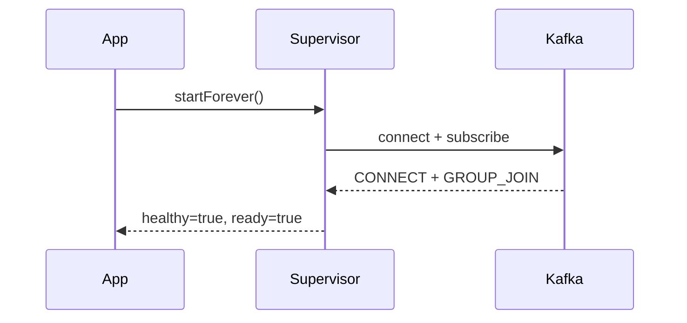
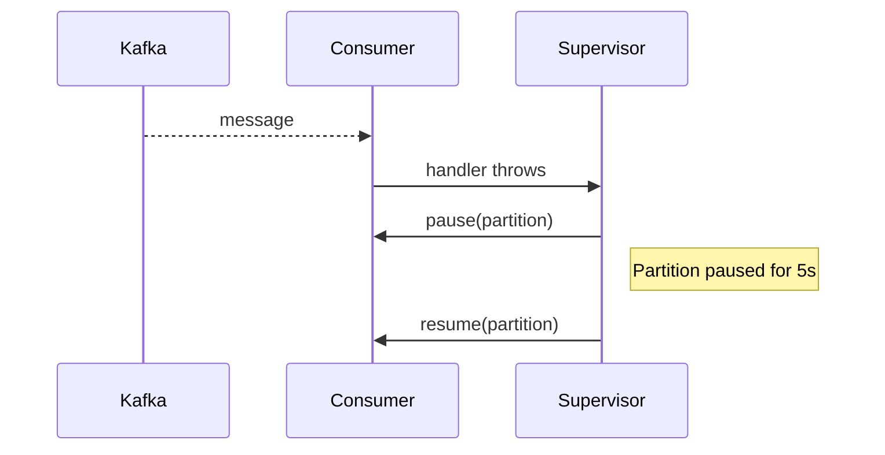
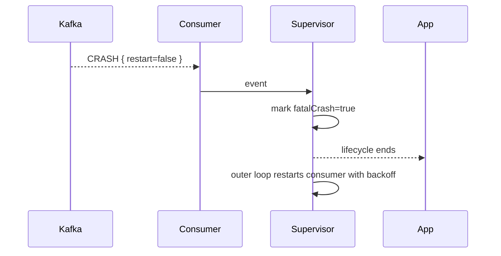
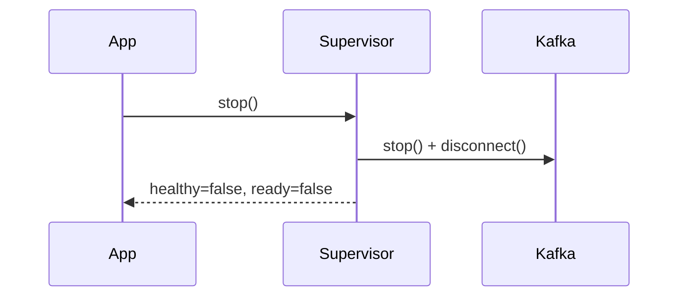
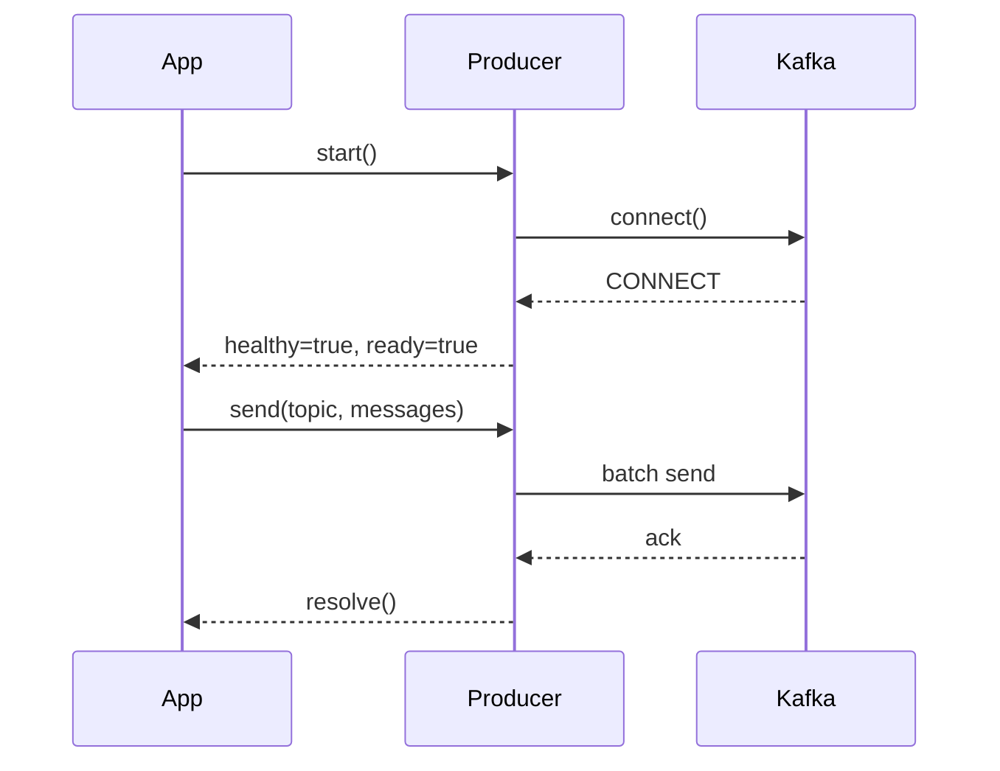
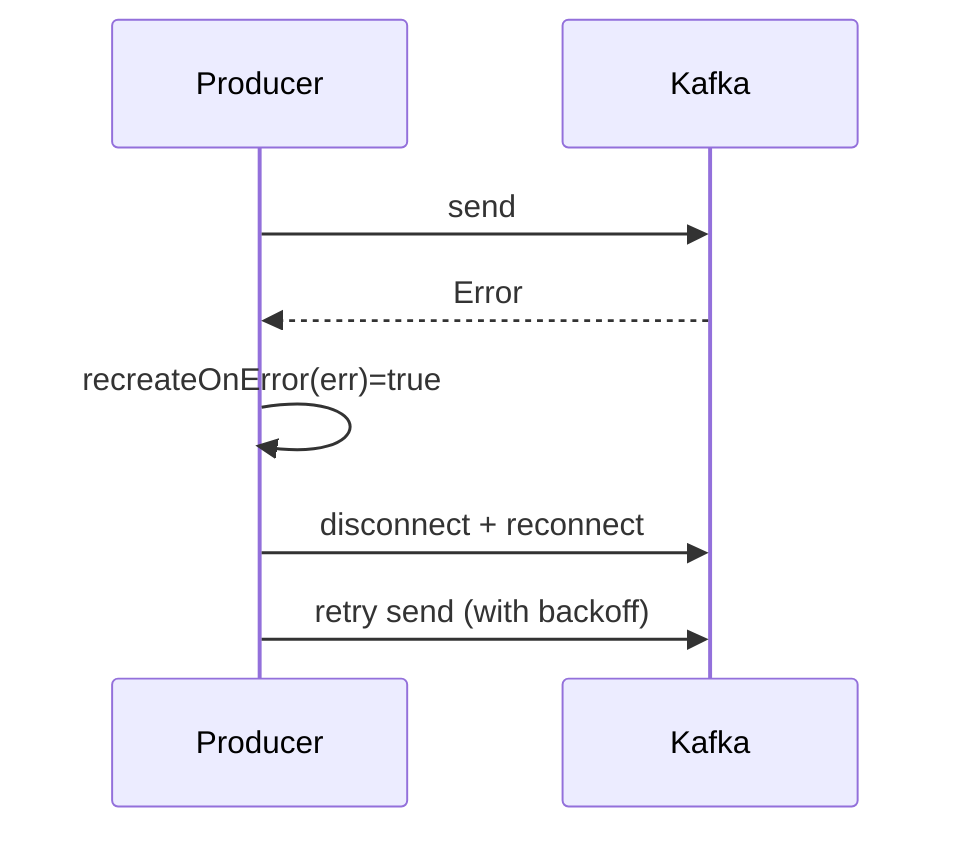
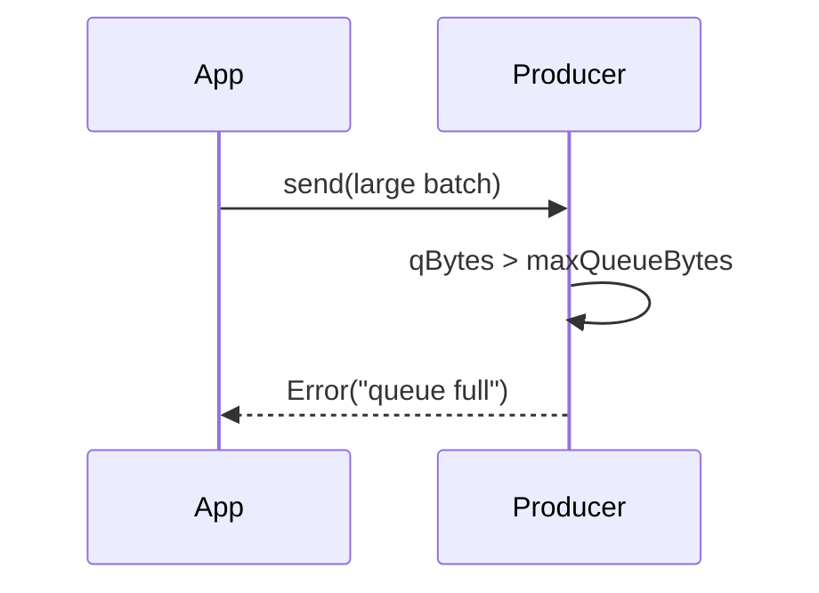
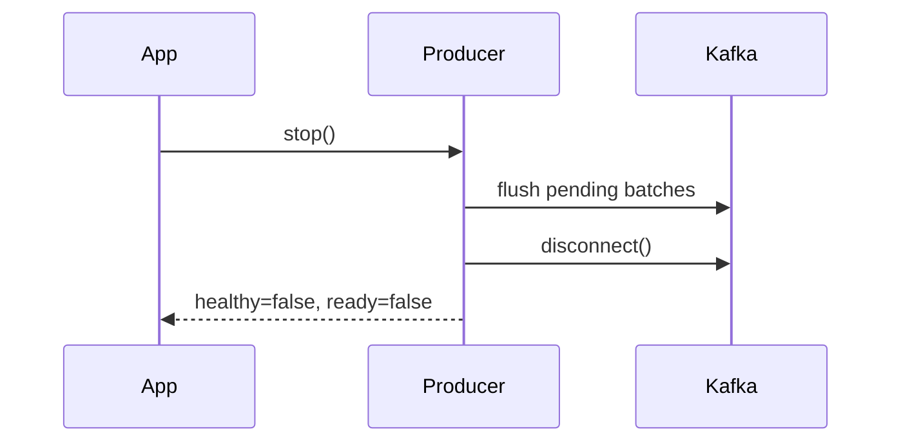

# SCENARIOS — Power-MSK v2

This document explains the behavior of **ConsumerSupervisor** and **ResilientProducer** in real-world scenarios.
The goal is to help developers understand *when a component restarts, when it pauses, and how resilience is enforced*.

---

## 🟢 ConsumerSupervisor Lifecycle

### Normal startup

* Consumer starts, joins group, begins processing.
* `isHealthy()` and `isReady()` both flip `true`.

---

### Message handler error (`eachMessage` / `eachBatch`)

* Partition where error occurred is **paused**.
* Automatically **resumes after 5s**.
* Supervisor keeps running; other partitions unaffected.

---

### Crash (KafkaJS emits `CRASH`)

* If `restart=true` → KafkaJS handles internally (no restart by us).
* If `restart=false` → Supervisor tears down and **recreates consumer**.
* Backoff = exponential + jitter.

---

### Stop

* Graceful stop shuts down the loop and disconnects.
* `isHealthy()` and `isReady()` both flip `false`.

---

## 🟢 ResilientProducer Lifecycle

### Normal flow

---

### Send error (recoverable)

* `send()` error triggers retry loop.
* If `recreateOnError(err)` returns true, producer is torn down + recreated.
* Entries in the batch resolve after retry succeeds.

---

### Backpressure

* Protects against OOM by bounding queue size.
* App should catch and retry later.

---

### Stop

---

## 🔄 Summary Table

| Scenario            | ConsumerSupervisor Action    | ResilientProducer Action     |
| ------------------- | ---------------------------- | ---------------------------- |
| Handler throws      | Pause partition (5s)         | N/A                          |
| Non-retriable CRASH | Recreate consumer w/ backoff | N/A                          |
| Kafka rebalance     | KafkaJS auto-handles         | N/A                          |
| Producer send error | N/A                          | Retry, optional recreate     |
| Queue full          | N/A                          | Reject send                  |
| stop() called       | Disconnect + mark unhealthy  | Flush, disconnect, unhealthy |

---
